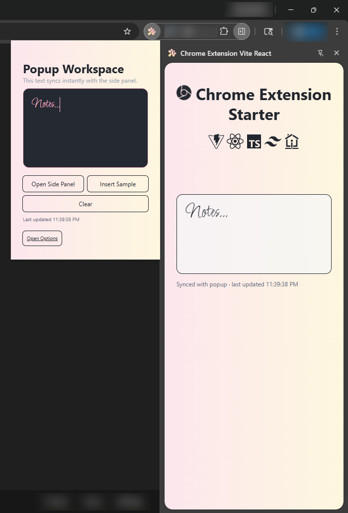
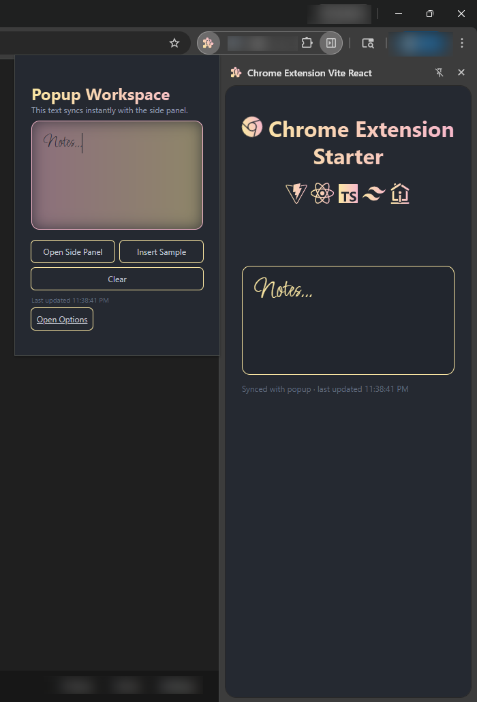

# Chrome Extension Vite React Starter

### Side Panel + Popup + Options


## 📖 Table of Contents

- [Overview](#overview)
- [Features](#features)
- [Tech Stack](#tech-stack)
- [Getting Started](#getting-started)
  - [Install](#install)
  - [Dev](#dev)
  - [Build](#build)
- [Load in Chrome](#load-in-chrome)
- [Scripts](#scripts)
- [Configuration](#configuration)
  - [Manifest](#manifest)
  - [Vite Build Outputs](#vite-build-outputs)
  - [TailwindCSS](#tailwindcss)
  - [Iconify](#iconify)
- [Usage Notes](#usage-notes)
- [Contribution](#contribution)

## ℹ️ Overview

A lightweight starter for building a Chrome Extension (Manifest V3) with side panel, popup, and options page. It uses Vite + React + TypeScript, Tailwind CSS v4, and Iconify with a service worker setup.

The architecture is based on an actively maintained production extension and reflects real-world usage.




## ✨ Features
- Quick start with full functionality
- Side Panel, Popup, and Options pages (MPA build) with shared state (service worker + storage)
- Manifest V3 service worker entry
- Tailwind CSS v4 with Iconify integration
- Optional reusable icon component that references both internal icon name registry and any raw Iconify class name
- Shared baseline styling example
- Version sync from `package.json` into `manifest.json`

## ⚛️ Tech Stack

- 
- 
- 
- 
- 
- 

## 🚀 Getting Started

### Install

```bash
npm install
```

### Dev

```bash
npm run dev
```

### Build

```bash
npm run build
```

## ⬆️ Load in Chrome

1. Build the extension: `npm run build`
2. Open `chrome://extensions`
3. Enable Developer Mode
4. Click "Load unpacked" and select the `build/` directory  
   (or drag and drop the `build` folder)

## 📜 Scripts

- `npm run dev` Start Vite dev server
- `npm run build` Build UI pages and service worker
- `npm run build-watch` Watch build for UI pages
- `npm run lint` Run ESLint
- `npm run format` Run Prettier to format files
- `npm run format:check` Check formatting with Prettier

## ⚙️ Configuration

### Manifest

###### [<u>Chrome Manifest V3 documentation</u>](https://developer.chrome.com/docs/extensions/reference/api)

The manifest lives in `assets/manifest.json`. It is copied during build and versioned via `build_scripts/syncVersion.ts`.

Key entries:

- `background.service_worker`: MV3 service worker entry
- `side_panel.default_path`: Side panel HTML
- `action.default_popup`: Popup HTML
- `options_page`: Options HTML

### Vite Build Outputs

###### [<u>Vite documentation</u>](https://vite.dev/guide/)

This boilerplate uses a multi-page app (MPA) build for the UI pages. Outputs:

- `build/src/sidePanel/index.html`
- `build/src/popup/index.html`
- `build/src/options/index.html`
- `build/service_worker.js`

### TailwindCSS

###### [<u>TailwindCSS documentation</u>](https://tailwindcss.com/docs/styling-with-utility-classes)

Tailwind v4 is configured in `tailwind.config.ts` and imported from each page entry (`index.css`).

### Iconify

###### [<u>Iconify documentation</u>](https://iconify.design/docs/usage/css/tailwind/tailwind4/) | [<u>Iconify references</u>](https://icon-sets.iconify.design)

Iconify is wired via `@iconify/tailwind4`. You can use the `Icon` component from `src/lib/icon/component.tsx` or reference icons in an element's class directly.

`Icon` has an attached optional registry to store and reference frequently used icons.

**Icon component usage:**

```tsx
import { Icon } from '@lib';

<Icon name='icon-[simple-icons--typescript]' size='3xl' color='blue-500' />

// Referencing registry key
<Icon name='typescript' size='3xl' color='blue-500' />
```

**Direct TailwindCSS usage:**

```html
<span className="icon icon-[simple-icons--typescript] text-3xl text-blue-500"></span>
```

## 📌 Usage Notes

- The service worker is built separately via `vite.worker.config.ts`.
- The Side Panel and Popup share state through `src/common/appBridge.ts`.
- Static assets live in `assets/` and are copied into the build output by Vite static copy.
- For content scripts, add them to the manifest and add a Vite input if you want them bundled.

## 🕊️ Contribution
Feel free to contribute or propose changes that improve the the project and flag any potential issues.